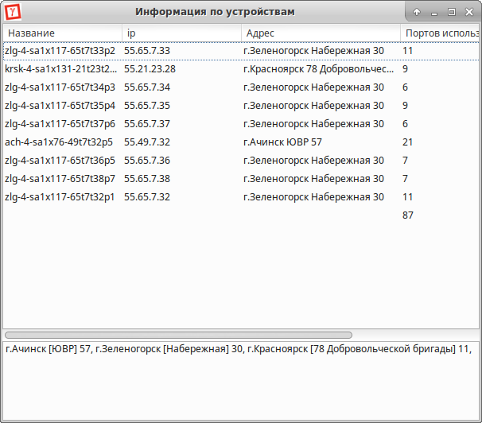
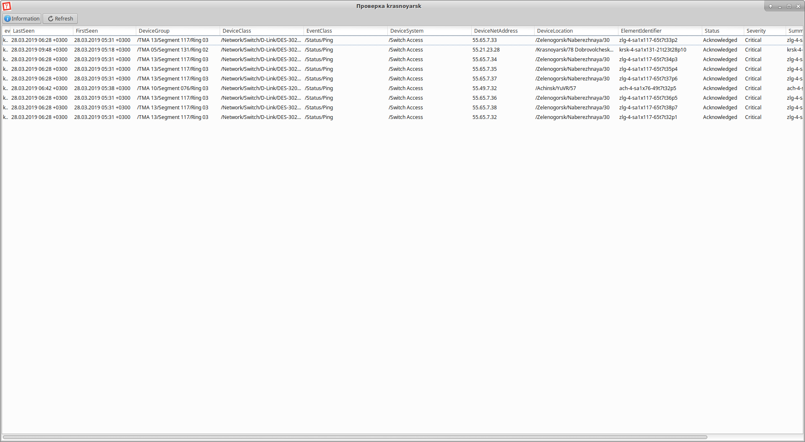

## monitor-events - приложение, отображающее события систем мониторинга zenoss

Основной функционал:

1. Чтение событий из топика брокера сообщений kafka
2. Отображение приложений в главном окне
   - Фильтрация событий по:
     - Источнику
     - Классам устройств
     - Классам событий
   - Выделение группы событий с последующим:
     - Отправкой в группу событий
     - Выводом информации по устройствам
     - Удалением событий
   - Очистка всех событий
3. Создание, удаления групп событий:
   - Отображение списка событий в отдельном окне группы событий
   - Вывод информации по устройствам группы событий
   - Выборочное удаление события из группы событий

**Пример главного окна приложения**

**Пример окна информация об устройствах**

**Пример окна группы событий**

